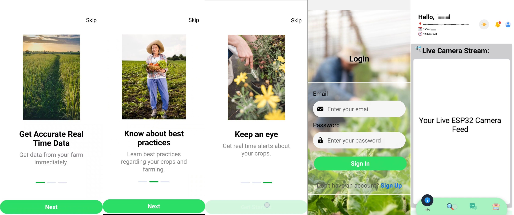
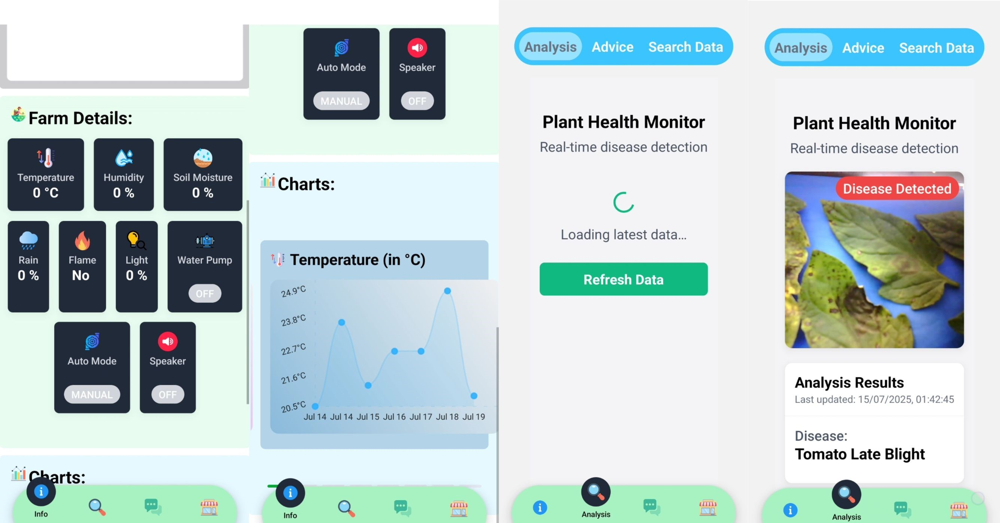
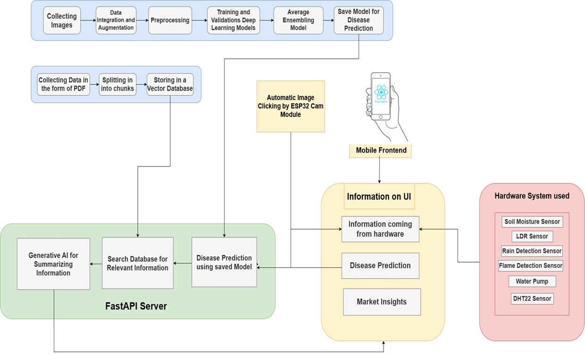
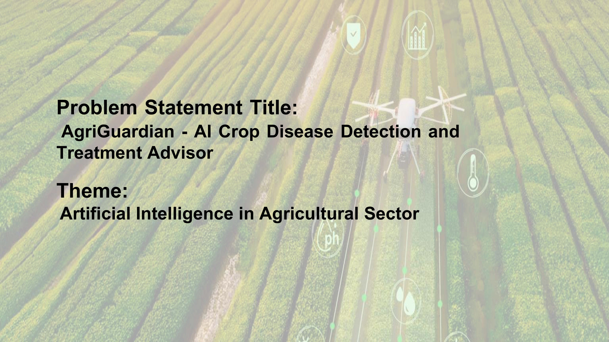
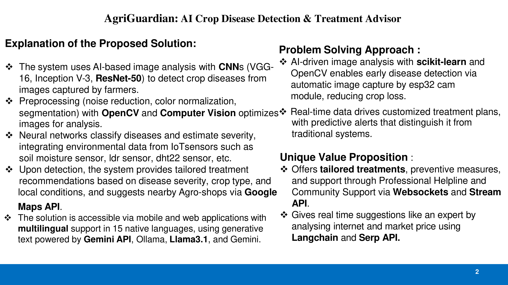
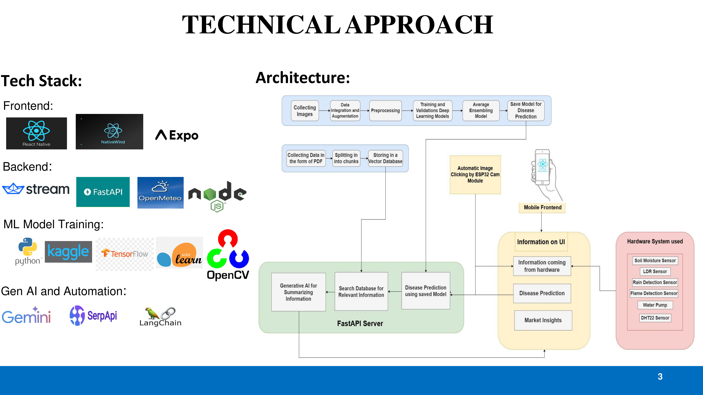
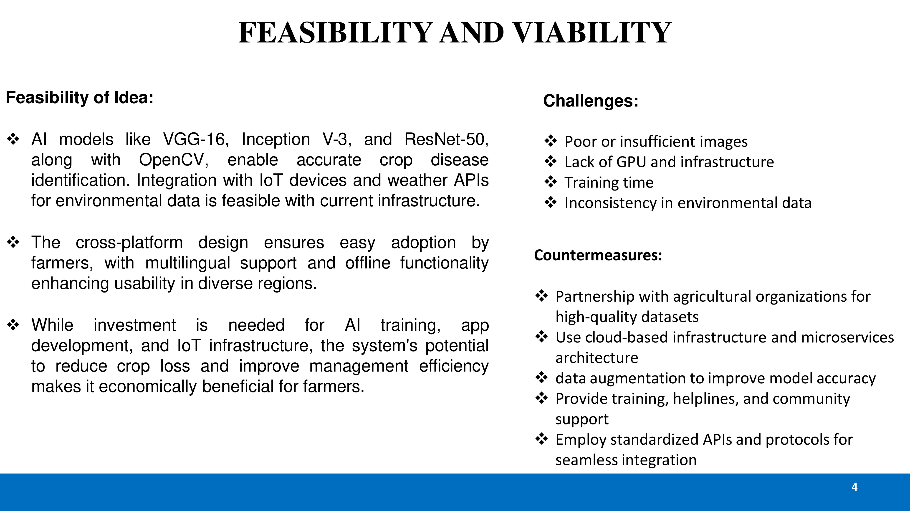
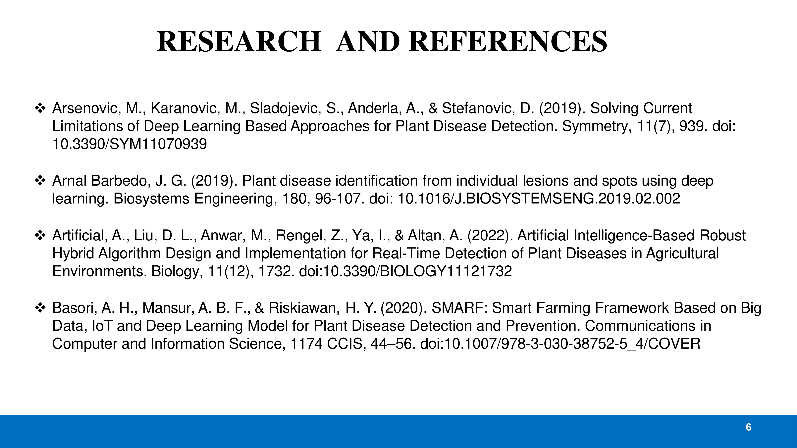

## AgriGuardian : AI Based Smart Crop Disease Dectector and Treatment Advisor




Agriguardian is a React Native mobile app that uses an ESP32-CAM module and environmental sensors (temperature, humidity, soil moisture, etc.) to capture real-time plant images and data for rapid crop-disease detection, then delivers tailored treatment recommendations with dosage guidelines; it also analyzes live market trends to suggest optimal selling prices, offers a global chat network for peer-to-peer support and expert advice, and features a location-aware shop finder to help farmers quickly locate nearby agro-suppliers.

## Table of Contents:
- [AgriGuardian : AI Based Smart Crop Disease Dectector and Treatment Advisor](#agriguardian--ai-based-smart-crop-disease-dectector-and-treatment-advisor)
- [Table of Contents:](#table-of-contents)
- [Technologies Used](#technologies-used)
- [Hardware Requirements](#hardware-requirements)
- [Software Requirements](#software-requirements)
- [Workflow](#workflow)
- [Setup](#setup)
  - [For Supabase](#for-supabase)
  - [For React Native](#for-react-native)
  - [For Python (AI Processing of Data)](#for-python-ai-processing-of-data)
  - [For ESP32](#for-esp32)
  - [For ESP32 Cam Module](#for-esp32-cam-module)
- [Running the App](#running-the-app)
- [Advantages](#advantages)
- [PPT](#ppt)

## Technologies Used
- React Native
- Expo
- Supabase
- Node.js
- Python
- FastAPI
- ESP32
- ESP32-CAM and Sensors
- Arduino IDE
- Embedded C
- NativeWindCSS
- Langchain
- Gemini
- Open Meteo

## Hardware Requirements
- ESP32‑CAM module (with onboard OV2640 camera)
- ESP32 development board (for Servo control library and extra I/O)
- FTDI module
- 128×64 I²C OLED display (SSD1306)
- DHT22 temperature & humidity sensor
- Soil‑moisture sensor (analog output)
- Rain‑detection sensor (analog output)
- Flame‑detection sensor (digital output)
- LDR Sensor
- Two hobby servos (for scanning and tilt: e.g. SG90)
- 5 V water pump
- Relay module (to drive the pump; active‑LOW relay)
- Piezo speaker or buzzer (for alerts/tone output)
- Four momentary push‑buttons (LEFT, RIGHT, UP, DOWN; wired with INPUT_PULLUP)
- I²C wiring (for OLED: SDA, SCL, VCC, GND)
- Jumper wires & breadboard or PCB
- 5 V power supply (capable of driving pump, servos, ESP32, sensors)
- Arduino Cable
- Micro USB Cable
- Power Source

**Note :** OLED and buttons are optional.

## Software Requirements
- [Node.js (Latest LTS Version)](https://nodejs.org/en/blog/release/v22.17.1)
- [Python (3.11.4)](https://www.python.org/downloads/release/python-3114/)
- [Arduino IDE](https://docs.arduino.cc/software/ide-v2/tutorials/getting-started/ide-v2-downloading-and-installing/)
- [Expo GO in Mobile (Expo GO 52)](https://expo.dev/go?sdkVersion=52&platform=android&device=false)

## Workflow
   

## Setup

Clone the repository.

### For Supabase
1. Go to [Supabase](https://supabase.com/).
2. Create a new project named Agriguardian.
3. Go to Authentication > Policies > Create Policy.
4. Create a new policy with the following configuration:
   ```bash
   Policy Name : Enable All for authenticated users only
   Table : public.Users
   Policy Command : All
   Target Roles: authenticated
   ```

### For React Native
1. Navigate to Root directory.
2. Open Terminal.
3. Run `npm install`.
4. This will install the required dependencies.
5. Create a .env file with the following environment variables:
   ```bash
    EXPO_PUBLIC_SUPABASE_URL=
    EXPO_PUBLIC_SUPABASE_API_KEY=
    EXPO_PUBLIC_ESP32_IP=
    EXPO_PUBLIC_ESP32_CAMERA_IP=
    EXPO_PUBLIC_CHARTS=https://api.open-meteo.com/v1/forecast? 
    EXPO_PUBLIC_PYTHON_SERVER=
   ```

### For Python (AI Processing of Data)
1. Navigate to Models Directory.
2. Create a virtual environment with Python 3.11.4 with name `.venv`.
3. Activate the virtual environment using command `.\venv\Scripts\activate`.
4. Run `pip install -r requirements.txt` to install the required dependencies.
5. Create a .env file with the following environment variables:
   ```bash
   GOOGLE_API_KEY = 
   ```
   which you can find from [here](https://aistudio.google.com/apikey).

### For ESP32
1. Navigate to ESP32 directory.
2. Follow the [tutorial](https://www.youtube.com/watch?v=uz8J8w-Uyd8) to install the ESP32 development board.
3. Upload the code to your ESP32.
4. Connect all the components to the ESP32 in following manners. 
   
| Components | VCC | GND | Signal Pin(s) | Notes
| --- | --- | --- | --- | ---
  | OLED 128×64 (SSD1306) | 3.3 V (or 5 V) | GND | SDA → GPIO 21 <br> SCL → GPIO 22 | I²C bus; reset (–) left unconnected
  | DHT 22 | 3.3 V | GND | Data → GPIO 4 | 10 K Ω pull‑up on data line
  | Soil Moisture Sensor | 3.3 V (or 5 V) | GND | Out → GPIO 34 | ADC1_6; use `analogRead()`
  | Rain Sensor | 3.3 V (or 5 V) | GND | Out → GPIO 35 | ADC1_7; use `analogRead()`
  | Flame Sensor | 3.3 V (or 5 V) | GND | Out → GPIO 15 | Digital, active LOW
  | LDR Sensor | 3.3 V (or 5 V) | GND | Out → GPIO 32 | ADC1_4; e.g. photoresistor
  | Water Pump Relay | 5 V | GND | IN → GPIO 26 | Active‑LOW relay, VCC = 5 V
  | Servo (Scan) | 5 V (or 3.3 V) | GND | PWM → GPIO 25 | Use ESP32PWM timer; 500–2400 µs pulse width
  | Servo (Tilt) | 5 V (or 3.3 V) | GND | PWM → GPIO 33 | Use separate ESP32PWM timer
  | Buzzer / Speaker | 3.3 V | GND | PWM → GPIO 17 | Use `tone()` for beeps/alerts
  | Left Button | - | GND | → GPIO 13 (INPUT_PULLUP) | Wire other leg to GND; reads LOW when pressed
  | Right Button | - | GND | → GPIO 12 (INPUT_PULLUP)
  | Up Button | - | GND | → GPIO 14 (INPUT_PULLUP)
  | Down Button | - | GND | → GPIO 27 (INPUT_PULLUP)

### For ESP32 Cam Module
1. Navigate to ESP32_Camera directory.
2. Connect the ESP32-CAM module to the FTDI in following manner. 
   
   | ESP32 Cam Module | FTDI |
   | --- | --- |
   | 5 V | VCC |
   | GND | GND |
   | UOT | RX |
   | UOR | TX |  

3. Connect the IO0 and GND of the ESP32-CAM module. (This is only done while uploading the code)
4. Upload the code to your ESP32-CAM module.
5. Disconnect the IO0 and GND of the ESP32-CAM module.
6. Restart the ESP32-CAM module.

## Running the App
1. Connect the ESP32, ESP32-CAM module, Mobile and Laptop (or PC) to the same network (Common WiFi or can be Mobile Hotspot).
2. Open the terminal.
3. Type `ipconfig` to get the IP address of your network.
4. Copy the IP address in `IPv4 Address` and paste in the `EXPO_PUBLIC_ESP32_CAMERA_IP` environment variable and `apiEndpoint` (line no. 21) of `ESP32_CAMERA.ino` and upload the code.
5. Connect the ESP32 and ESP32 CAM module to Laptop and check Serial Monitor. Note the IP address on which these devices are running and paste these IPs in `EXPO_PUBLIC_ESP32_IP` and `EXPO_PUBLIC_ESP32_CAMERA_IP` respectively.
6. Navigate to Models folder and open terminal and run `uvicorn prediction_server:app --host 0.0.0.0 --port 8000` to start the python server. You can also check if the python server is running by going to `http://<YOUR_IP_ADDRESS>:8000/` in your browser. If not working, check the IP address again.
7. Now go to root directory and run `npx expo start -c` to start the app. You will get a QR code there.
8. Open the Expo Go App in your mobile and scan the QR code.
9. Wait for the app to load and bundle everything.
10. You are all set to go!

## Advantages
- Upto 94% accuracy in crop disease detection.
- Upto 99% accuracy in weather prediction.
- Use of Hardware for real time data collection.
- Cross Platform Application.
- Can also suggest optimal selling prices.
- Can also be used as a remote monitoring system.

## PPT





